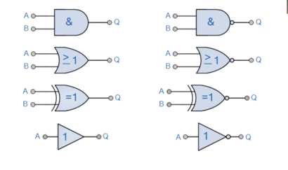
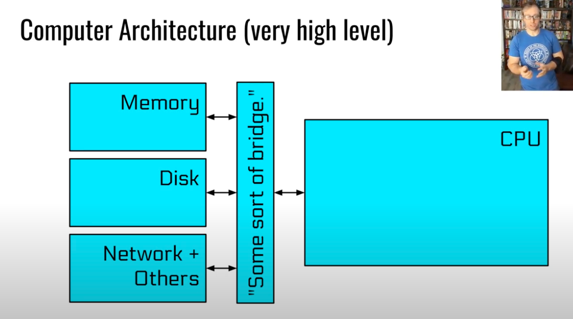
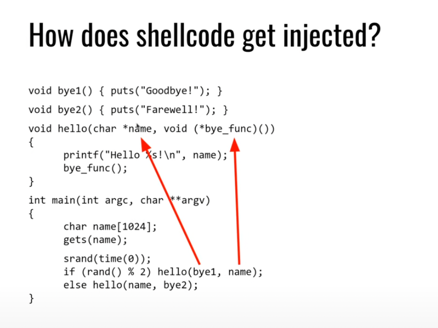
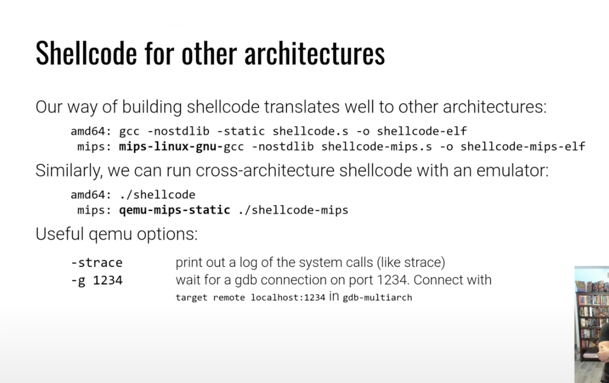
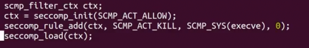
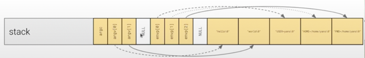
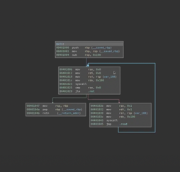

~~# Security Repo

## Introduction

### Purpose:
This repo is supposed to act a documentation for the security lessons that I learn so that if any future CCS Computing Freshman find themselves wanting to learn about the basics of computer security, they have a place to start.

As I write this, I know little to none about security. I've gone through the first unit or two of the pwn.college class. The first section will go into my assumptions about security and what I've learned from the first two chapters

I hope this proves useful for whomever proceeds me!

### Resources that I've been Recommended

The important places that I've been told to look at when beginning to learn security are the following:

 1) [pwn.college](https://pwn.college)
    - this is a tool developed by Arizona State University Students and is a good place to start if you want to get a feel for what exploitation of applications looks like
    - There are a lot of problems for each unit, my advice is to skip about half to three fourths of the problems in the first unit and about half of them in the second unit
 2) [UCSB CS 279: Advanced Topics in Computer Security with Giovanni Vinga](https://www.youtube.com/watch?v=NNDm8lRCb20&list=PL5H0SXHF1jMVpMEEcddvGJ_ZhqFwxmpO5&ab_channel=GiovanniVigna)
    - This is the security class taught by Giovanni Vinga who is one of the two people who run the security lab at UCSB.
    - As of writing this introduction, I have not yet watched this, but it was personally recommended to me by Giovanni Vigna
    - Also, this is probably not the best course to start with given that it is an advanced topics class
 3) [Decentralized Finance](https://defi-learning.org/)
    - This course is about Decentralized Finance and also personally recommended to me by Giovanni Vinga.
    - Unlike the other courses, this is its own kind of topic

##Base Knowledge

At This point I'd like to go through what I have learned at this point from the resources above as well as from the conversations that I've had with industry experts.

This Is subject to being wrong, though I will attempt to come back and revise any information that I find out later is incorrect

Security seems to be split into two main categories:
1) Systems Security
2) Cryptography

Systems Security refers to programming and computer science techniques that are used to secure applications and hardware

Systems Security can include but is certainly not limited to:
- Binary analysis
- Application exploitation

Cryptography refers to the mathematical techniques that used to encrypt data.

## Notes Session 1:

Goal: Go through lectures for unit 2 and 3 of PWN.College

I will include longform notes below and well as a summary:

### Notes:

[1st Video](https://www.youtube.com/watch?v=ZWxYWdiXqD8):

### ___Privilege Escalation___

The most common way to privilege escalate is sudo, this is of course not a working solution for hacking but is the most common within development

Each process has 3 types of UIDs:
1) Effective (eUID) -> The UID that is sued for most access checks
2) Real (rUID) -> used for signal checks
3) Saved -> used for temporary privileges

eUID 0 is the root user. It can 
- Open any file
- Execute any program
- Assume any and all UIDs and GID
- Debug any program

Root if exploited can be disastrous

`ls /proc` will show all the processes running on the computer. Root can get the memory of all of them.

Privilege Escalation Exploit an exploit in which an attacker raises their permissions to root level.

The typical flow is as follows:
1) Gain a foothold on the system through some vulnerable service
2) Find a vulnerable privileged service
3) Exploit the service to gain its privilege

There are a surprising number of vulnerabilities in SUID binaries and through applications unnecessary use of SUDOing

There are kernel level vulnerabilities as well that can be exploited

[2nd Video](https://www.youtube.com/watch?v=kzbyvr_PJ9k)

### ___Program Misuse - Mitigations___

Security Issues are a fact of programming, so programmers need to find a way to reduce the damage that can be caused by exploits.

Common Theme: mitigations reduce but do not eliminate the potential for harm.

Most command injection vulnerabilities occur through `/bin/sh`

The mitigation, if `/bin/sh` runs as root, then it will reduce the privileges of the program to the rUID
that can be disabled with `/bin/sh -p`

Wireshark: Network sniffer that causes security problems. It requires a lot of privileges to look at network traffic

Mitigation -> Separate the process into programs:
1) Records Traffic (wireshark): This one is the one that requires the privileges
2) Dumps Traffic (dumpcap)

[3rd Video](https://www.youtube.com/watch?v=9jc0eSnrzF4)

### ___Computer Architecture___

All programs will eventually be reduced down to binary encoded instructions that run on the CPU

The CPU is made up of logic gates (among other things)

Some Logic gates are shown below:

Computer Architecture can be reduced down to the following:

[4th Video](https://www.youtube.com/watch?v=ImdnOGNZflU)

### ___Assembly___

The CPU only accepts assembly as a programming language

CPU has registers which are expensive because they're directly integrated into the CPU

## Notes Session 2:

Von Neumann architecture treats code as data
Harvard Architecture stores data and code separately

Notice how the input parameter name is being treated as a function. This means that if the string looks like C code, it can execute.

Modern computers usually have mitigations against this but vulnerabilities can be easily found.

####Morris Internet Worm

First shellcode injection to get foothold on machine

This worm disconnected the whole intern

[The Morris Worm Code](https://blog.rapid7.com/2019/01/02/the-ghost-of-exploits-past-a-deep-dive-into-the-morris-worm/)

Why is it shell code? -> Goal is to run a shell command

You write the shellcode as assembly code and then compile it into an ELF file. Finally, pull out the raw bytes with an object copy command

You can trace shellcode from a high level with `strace` which traces all system calls

At a lower level, you can use gdb to debug shellcode

Shellcode for other architectures:

## Project 1: writing a shellcode injection

### Goal:
To write a purposefully vulnerable program and show a demo (with steps) for how to exploit that vulnerability

### Steps to Creation:

1) Write a program in C that has a vulnerability (The code for it will be available in /demos/shellcode_injection). For this program I wrote a very simple vulnerability, it's important to recognize that while this seems like it would never happen in the real world, version of this can occur very often.
2) Write assembly code to start a /bin/sh instance
3) compile the assembly code into the raw bytes
4) cat the bytes as the input into the vulnerable file

The code for this project with the compiled raw bytecode is in /demos/shellcode_injection

[5th Video](https://www.youtube.com/watch?v=GH4NBLtPmyo)

Since The John Von Neumann architecture doesn't see a difference between code and data, it can cause exploits to be discovered

Now computer architecture designers see data and code as two different things.

Modern computers also consider memory permissions (called DEP (data execution protection) on Windows. On linux: n-ex).

Shell-coding has thus become nearly extinct. Its still present in embedded devices

IDEA #1:

de-protect the memory with mprotect() system call

## New Unit - Sandboxing

[Introduction](https://www.youtube.com/watch?v=Ide_eg-eQZ0)

Back in the 1950s the code ran extremely close to the hardware
Code could do anything on the machine

In the 60s, the split between the OS and userspace arose (processes could still clobber each other)

In the 80s, the rise of virtual memory allowed processes to run in different parts of memory

In the 90s, scripting languages created a separation between the interpreter and interpreted code

Web Browsers in the 2000s brought vulnerabilities because browsers did so much. Plugins that would run in the browser could run with the full permissions of the user using it.

It was a wild west of security

"Drive by Download" targeted these plugins

The rise of Sandboxing:
1) Spawn "privileged parent process"
2) Spawn "sandboxed child process"
3) When a child needs to perform a privileged action, it asks the parent

Sandboxing is so effective that a second vulnerability is required to bypass it and exploit the first vulnerability

[Sandboxing: chroot](https://www.youtube.com/watch?v=C81lO7pG5aA)

chroot first appeared in 1979

It changed the meaning of slash to another directory

chroot will make it so the process cannot exceed the bounds of that root

chroot used to be the defacto method of sandboxing

It requires certain privileges (usually ones of root user)

chroot stands for "change root"

running a command like `sudo chroot /tmp/jail /bin/bash` would say that /bin/bash doesn't exist becuase it doesnt exist in /tmp/jail

chroot has exactly 2 effects:
- changes the meaning of "/" to the location of the first parameter
- change /temp/jail/.. to go to /temp/jail

must make sure to change directory to "/" or else you will end up in the home directory

chroot wont change the current working directory, that makes it dangerous

Chroot is not safe, it doesnt affect the communication with other processes and has become obsolete

[Seccomp](https://www.youtube.com/watch?v=hrT1xvxGKS4)

Seccomp is a way to heavily restrict system calls through kernel-level sandboxing

A user can set the rules of Seccomp

^ Simple code to build in a sandbox to your code

Going through the code line by line:
1) it creates a seccomp context object
2) it initializes it with a default policy
3) it sets a rule foe the seccomp object to kill the program it if the program tries to call execve
4) it loads it all into the object and sets the policy

How does Seccomp work?

Seccomp uses the kernel functionality eBPF

eBPF are programs that run in an in-kernel, "safe" environment (usually a virtual type machine)

[Escaping Seccomp](https://www.youtube.com/watch?v=h1L9mF6PHlQ)

####Breaking out

To do anything useful, a sandboxed process needs to interact with privileged processes

some vectors of attack:
- permissive policies
- syscall confusion
- kernel vulnerabilities

Permissive Policies:
Combination of:
1) system calls are complex, and there are a lot of them
2) Developers might avoid breaking functionality by erring on the side of permissiveness

## New Unit: Reverse Engineering

[Introduction](https://www.youtube.com/watch?v=ClVocVk1c5g)

Forward Engineering Process:
simply:
1) figure out what you wanna code
2) code it
3) compile it
4) run it

More in depth:
1) design
2) code
3) compile
4) debug
5) compile
6) debugging
7) repeat
8) assemble

There is a disconnect between design and code

the compiler further abstracts the code from the original design including:
- comments
- variable names
- function names
- structure data
- even sometimes entire algorithms

Even further, usually programs are stripped of all relevant metadata

The reverse engineering process:

1) disassemble
2) decompile
3) Lots of thinking
4) understand

The reverse engineering process is largely human oriented

###[Functions and Frames](https://www.youtube.com/watch?v=3IdeyjrMBA4)

A program is...
- consists of modules
- each is make up of functions
- that contain blocks
- of instructions
- that operate on variables and data structures

Modules are collections of functions shipped in libraries

Functions represent well encapsulated functionality

initially, function can be reversed engineered in isolation but are able to be combined later to get a more complete description

You can represent function in a graph where each chunk of code is a block and there are edges between graphs which represent conditional and unconditional jumps

functions in assembly usually have a prologue and an epilogue which edit the stack frame

The stack is usually used to store local variables (note that the stack grows backwards i.e. subtract from the stack pointer to increase the size of the stack)

The stack usually holds the initial values of the program like environment variables and arguments to the bash executable call

notice that the variables that the arguments are hold are not where the arguments are. The arguments are merely pointers to those variables.

when you call a function on the stack, the return address is popped onto the stack

###[Data Access](https://www.youtube.com/watch?v=AtVprTb5xBs)

programs operate on data which is stored in various places (.data .rodata .bss stack heap)

###[Static Tools](https://www.youtube.com/watch?v=ls4Eoew6aSY)

static reverse engineering: analyzing a program at rest.

###Some Simple Tools:

kaitai struct: file format parser and explorer

nm: lists symbols used in elf files

strings: dumps ASCII strings found in file

obj dump: simple disassembler

checksec: analyzes security features used by an executable

###Advanced Disassemblers:

Commercial:

- IDA Pro: the "gold standard" of disassemblers
- Binary Ninja: IDA's main commercial competitor

Free:
- Binary Ninja Cloud

Open source:
- angr management: an academic binary analysis framework!
- ghidra: a reversing tool created by the NSA
- cutter: a reversing tool created by the radare2 open source project

This is what it would look like when you disassemble the function into a graph

some tools can actually transform the assembly into some type of source code

###[Dynamic Tools](https://www.youtube.com/watch?v=HcBordv7aWU)

- ltrace (traces library calls)
- strace (traces system calls)

Running the program with multiple different inputs might get you farther.
- ltrace the program with input A
- ltrace the program again with input B
- try to reverse the algorithm

try to look at the executable with gdb (lldb on mac)

look at gdb scripting: automate the reverse engineering

### Errata: Dealing with PIE:

Position Dependant Executables are loaded at a static address in memory

Position Independent Executables are not

### Timeless Debugging:

Timeless debugging frees you from having to think of breakpoints ahead of time:

1) record execution
2) rewind execution
3) replay execution

relevant tools:
- gdb
- rr
- qira

###[Real World Execution](https://www.youtube.com/watch?v=2pqvHSy11JE)

###License Checkers:

Before software had internet access, it had to check it wasn't being pirated

License key check:
- Developer would create some algorithm that takes in an input, perform some calculation and then validate the results

the method trusts the binary to keep the secrets in the algorithm

there was a Rise of Keygens

Evolution of the DRM:

anti-debugging fight dynamic analysis
Wrapping the DRM in an emulator to make it harder to read what is happening
Trusted Execution Environments move the DRM outside of the CPU into protected hardware

Reverse Engineering for Modding:

Examples: 
- the Skyrim Script Engine
- Dwarf Fortress: DFHack
- cheats for games