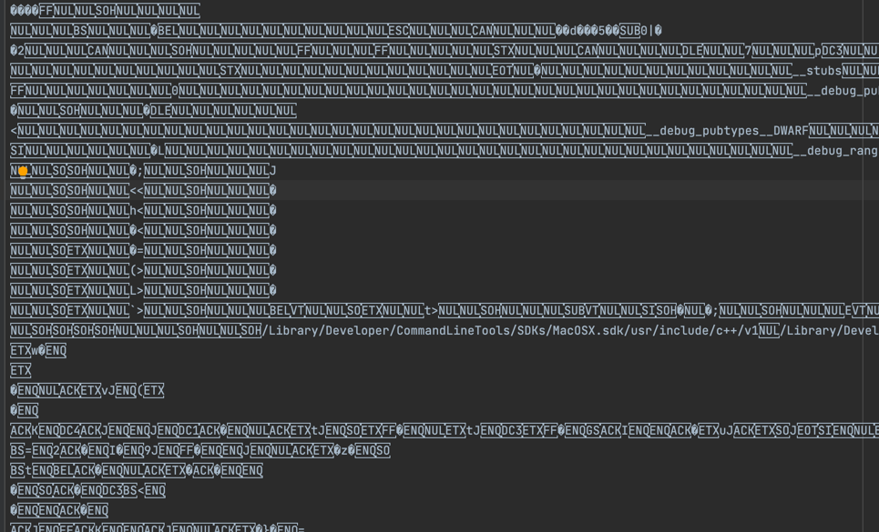
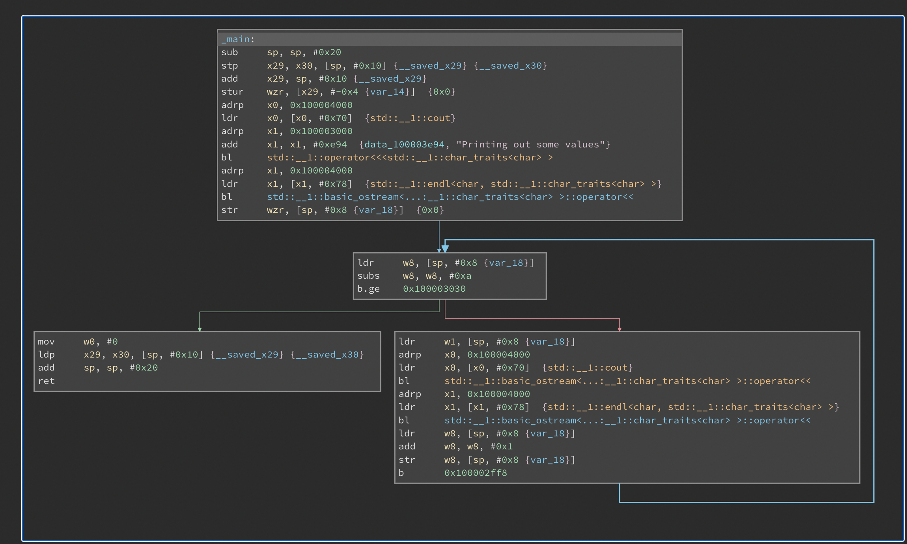
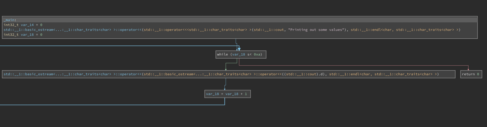
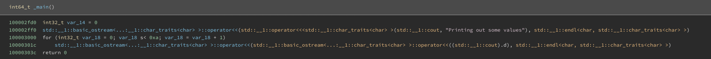

# Reverse Engineering Demo

## Goal:
to use reverse engineering tools to try to compile programs of varying complexities and attempt to reverse engineer it back to the original source code

## Method:

At a high level what im going to do is:
1) Write a simple c++ source file
2) compile it to elf 
3) use a tool like binary ninja cloud to get it back to the original source code or at least make it as readable as possible

##Actual implementation:

I wrote source code and put it in`source_code.cpp` it's a very simple program that does two main things that I want to see the decompiler replicate:
1) has a string which is printed out
2) has a loop

Once this was written I ran the command to compile it into ELF `g++ -Wall -g source_code.cpp -o compiled`

The actual ELF file is pretty much unreadable

So now, feeding this into [Binary ninja cloud](https://cloud.binary.ninja/) It read the machine code and first converted it into an assembly graph format

We can see the looping present here (notice the blue line on the bottom right box)

We can also see the string in the top box

But the really cool part of this application is that it attempts to get the source code:

Here we can directly see the loop happening.

In another window we can get a much more direct view of the code:

This code (while not as succinct as the original does maintain the spirit of the original file which given that it had only the ELF code above is an incredibly impressive feat)
